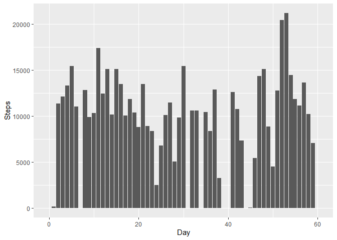
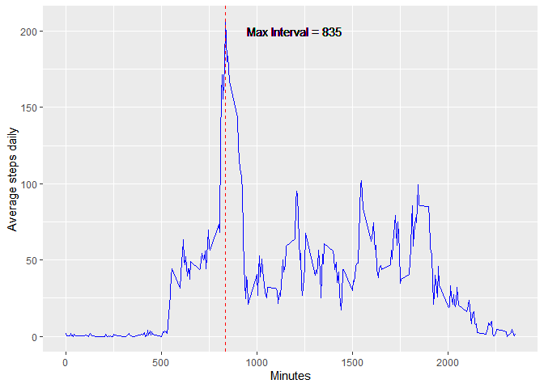
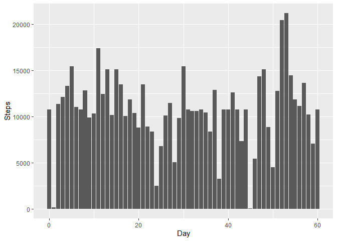
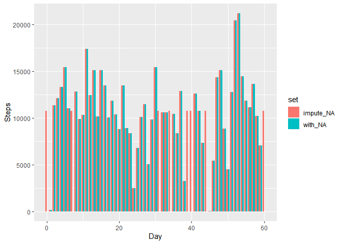
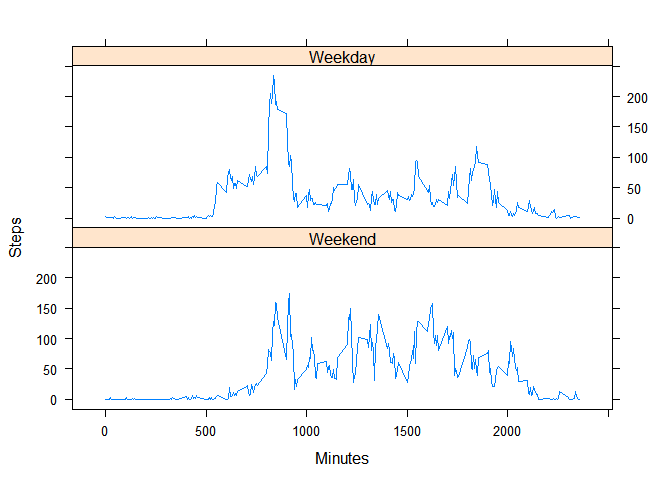

## Packages 

```r
library(ggplot2)
library(lubridate)
library(dplyr)
library(lattice)
library(xtable)
library(impute)
```

```
## Warning: package 'impute' was built under R version 4.0.3
```


## Loading and preprocessing the data


```r
data <- read.csv("activity.csv")
data$date <- strptime(data$date, format = "%Y-%m-%d")
data$day<- as.integer(difftime(data$date, data$date[1], units = "days"))
```


## What is mean total number of steps taken per day?

I Summary in data.frame *df*,  total, mean and median steps by day.


```r
summary_steps <- data %>% group_by(day) %>% 
    summarise(Total = sum(steps, na.rm = T), Media=mean(steps, na.rm = T), 
              Mediana = median(steps, na.rm = T))
```


```r
ggplot(summary_steps, aes(day, Total)) + ylab("Steps") + xlab("Day")+
    geom_bar(stat = "Identity")
```

<!-- -->


```r
xt <- xtable(summary_steps, caption = "Table 1. Mean and median number of steps taken each day", 
             align = "ccccc", digits = 2)
print(xt, type="html", html.table.attributes = 'align="center", width=40%, 
                                                frame="below", rules="rows"')
```

<!-- html table generated in R 4.0.2 by xtable 1.8-4 package -->
<!-- Fri Oct 30 17:01:49 2020 -->
<table align="center", width=40%, 
                                                frame="below", rules="rows">
<caption align="bottom"> Table 1. Mean and median number of steps taken each day </caption>
<tr> <th>  </th> <th> day </th> <th> Total </th> <th> Media </th> <th> Mediana </th>  </tr>
  <tr> <td align="center"> 1 </td> <td align="center">   0 </td> <td align="center">   0 </td> <td align="center">  </td> <td align="center">  </td> </tr>
  <tr> <td align="center"> 2 </td> <td align="center">   1 </td> <td align="center"> 126 </td> <td align="center"> 0.44 </td> <td align="center"> 0.00 </td> </tr>
  <tr> <td align="center"> 3 </td> <td align="center">   2 </td> <td align="center"> 11352 </td> <td align="center"> 39.42 </td> <td align="center"> 0.00 </td> </tr>
  <tr> <td align="center"> 4 </td> <td align="center">   3 </td> <td align="center"> 12116 </td> <td align="center"> 42.07 </td> <td align="center"> 0.00 </td> </tr>
  <tr> <td align="center"> 5 </td> <td align="center">   4 </td> <td align="center"> 13294 </td> <td align="center"> 46.16 </td> <td align="center"> 0.00 </td> </tr>
  <tr> <td align="center"> 6 </td> <td align="center">   5 </td> <td align="center"> 15420 </td> <td align="center"> 53.54 </td> <td align="center"> 0.00 </td> </tr>
  <tr> <td align="center"> 7 </td> <td align="center">   6 </td> <td align="center"> 11015 </td> <td align="center"> 38.25 </td> <td align="center"> 0.00 </td> </tr>
  <tr> <td align="center"> 8 </td> <td align="center">   7 </td> <td align="center">   0 </td> <td align="center">  </td> <td align="center">  </td> </tr>
  <tr> <td align="center"> 9 </td> <td align="center">   8 </td> <td align="center"> 12811 </td> <td align="center"> 44.48 </td> <td align="center"> 0.00 </td> </tr>
  <tr> <td align="center"> 10 </td> <td align="center">   9 </td> <td align="center"> 9900 </td> <td align="center"> 34.38 </td> <td align="center"> 0.00 </td> </tr>
  <tr> <td align="center"> 11 </td> <td align="center">  10 </td> <td align="center"> 10304 </td> <td align="center"> 35.78 </td> <td align="center"> 0.00 </td> </tr>
  <tr> <td align="center"> 12 </td> <td align="center">  11 </td> <td align="center"> 17382 </td> <td align="center"> 60.35 </td> <td align="center"> 0.00 </td> </tr>
  <tr> <td align="center"> 13 </td> <td align="center">  12 </td> <td align="center"> 12426 </td> <td align="center"> 43.15 </td> <td align="center"> 0.00 </td> </tr>
  <tr> <td align="center"> 14 </td> <td align="center">  13 </td> <td align="center"> 15098 </td> <td align="center"> 52.42 </td> <td align="center"> 0.00 </td> </tr>
  <tr> <td align="center"> 15 </td> <td align="center">  14 </td> <td align="center"> 10139 </td> <td align="center"> 35.20 </td> <td align="center"> 0.00 </td> </tr>
  <tr> <td align="center"> 16 </td> <td align="center">  15 </td> <td align="center"> 15084 </td> <td align="center"> 52.38 </td> <td align="center"> 0.00 </td> </tr>
  <tr> <td align="center"> 17 </td> <td align="center">  16 </td> <td align="center"> 13452 </td> <td align="center"> 46.71 </td> <td align="center"> 0.00 </td> </tr>
  <tr> <td align="center"> 18 </td> <td align="center">  17 </td> <td align="center"> 10056 </td> <td align="center"> 34.92 </td> <td align="center"> 0.00 </td> </tr>
  <tr> <td align="center"> 19 </td> <td align="center">  18 </td> <td align="center"> 11829 </td> <td align="center"> 41.07 </td> <td align="center"> 0.00 </td> </tr>
  <tr> <td align="center"> 20 </td> <td align="center">  19 </td> <td align="center"> 10395 </td> <td align="center"> 36.09 </td> <td align="center"> 0.00 </td> </tr>
  <tr> <td align="center"> 21 </td> <td align="center">  20 </td> <td align="center"> 8821 </td> <td align="center"> 30.63 </td> <td align="center"> 0.00 </td> </tr>
  <tr> <td align="center"> 22 </td> <td align="center">  21 </td> <td align="center"> 13460 </td> <td align="center"> 46.74 </td> <td align="center"> 0.00 </td> </tr>
  <tr> <td align="center"> 23 </td> <td align="center">  22 </td> <td align="center"> 8918 </td> <td align="center"> 30.97 </td> <td align="center"> 0.00 </td> </tr>
  <tr> <td align="center"> 24 </td> <td align="center">  23 </td> <td align="center"> 8355 </td> <td align="center"> 29.01 </td> <td align="center"> 0.00 </td> </tr>
  <tr> <td align="center"> 25 </td> <td align="center">  24 </td> <td align="center"> 2492 </td> <td align="center"> 8.65 </td> <td align="center"> 0.00 </td> </tr>
  <tr> <td align="center"> 26 </td> <td align="center">  25 </td> <td align="center"> 6778 </td> <td align="center"> 23.53 </td> <td align="center"> 0.00 </td> </tr>
  <tr> <td align="center"> 27 </td> <td align="center">  26 </td> <td align="center"> 10119 </td> <td align="center"> 35.14 </td> <td align="center"> 0.00 </td> </tr>
  <tr> <td align="center"> 28 </td> <td align="center">  27 </td> <td align="center"> 11458 </td> <td align="center"> 39.78 </td> <td align="center"> 0.00 </td> </tr>
  <tr> <td align="center"> 29 </td> <td align="center">  28 </td> <td align="center"> 5018 </td> <td align="center"> 17.42 </td> <td align="center"> 0.00 </td> </tr>
  <tr> <td align="center"> 30 </td> <td align="center">  29 </td> <td align="center"> 9819 </td> <td align="center"> 34.09 </td> <td align="center"> 0.00 </td> </tr>
  <tr> <td align="center"> 31 </td> <td align="center">  30 </td> <td align="center"> 15414 </td> <td align="center"> 53.52 </td> <td align="center"> 0.00 </td> </tr>
  <tr> <td align="center"> 32 </td> <td align="center">  31 </td> <td align="center">   0 </td> <td align="center">  </td> <td align="center">  </td> </tr>
  <tr> <td align="center"> 33 </td> <td align="center">  32 </td> <td align="center"> 10600 </td> <td align="center"> 36.81 </td> <td align="center"> 0.00 </td> </tr>
  <tr> <td align="center"> 34 </td> <td align="center">  33 </td> <td align="center"> 10571 </td> <td align="center"> 36.70 </td> <td align="center"> 0.00 </td> </tr>
  <tr> <td align="center"> 35 </td> <td align="center">  34 </td> <td align="center">   0 </td> <td align="center">  </td> <td align="center">  </td> </tr>
  <tr> <td align="center"> 36 </td> <td align="center">  35 </td> <td align="center"> 10439 </td> <td align="center"> 36.25 </td> <td align="center"> 0.00 </td> </tr>
  <tr> <td align="center"> 37 </td> <td align="center">  36 </td> <td align="center"> 8334 </td> <td align="center"> 28.94 </td> <td align="center"> 0.00 </td> </tr>
  <tr> <td align="center"> 38 </td> <td align="center">  37 </td> <td align="center"> 12883 </td> <td align="center"> 44.73 </td> <td align="center"> 0.00 </td> </tr>
  <tr> <td align="center"> 39 </td> <td align="center">  38 </td> <td align="center"> 3219 </td> <td align="center"> 11.18 </td> <td align="center"> 0.00 </td> </tr>
  <tr> <td align="center"> 40 </td> <td align="center">  39 </td> <td align="center">   0 </td> <td align="center">  </td> <td align="center">  </td> </tr>
  <tr> <td align="center"> 41 </td> <td align="center">  40 </td> <td align="center">   0 </td> <td align="center">  </td> <td align="center">  </td> </tr>
  <tr> <td align="center"> 42 </td> <td align="center">  41 </td> <td align="center"> 12608 </td> <td align="center"> 43.78 </td> <td align="center"> 0.00 </td> </tr>
  <tr> <td align="center"> 43 </td> <td align="center">  42 </td> <td align="center"> 10765 </td> <td align="center"> 37.38 </td> <td align="center"> 0.00 </td> </tr>
  <tr> <td align="center"> 44 </td> <td align="center">  43 </td> <td align="center"> 7336 </td> <td align="center"> 25.47 </td> <td align="center"> 0.00 </td> </tr>
  <tr> <td align="center"> 45 </td> <td align="center">  44 </td> <td align="center">   0 </td> <td align="center">  </td> <td align="center">  </td> </tr>
  <tr> <td align="center"> 46 </td> <td align="center">  45 </td> <td align="center">  41 </td> <td align="center"> 0.14 </td> <td align="center"> 0.00 </td> </tr>
  <tr> <td align="center"> 47 </td> <td align="center">  46 </td> <td align="center"> 5441 </td> <td align="center"> 18.89 </td> <td align="center"> 0.00 </td> </tr>
  <tr> <td align="center"> 48 </td> <td align="center">  47 </td> <td align="center"> 14339 </td> <td align="center"> 49.79 </td> <td align="center"> 0.00 </td> </tr>
  <tr> <td align="center"> 49 </td> <td align="center">  48 </td> <td align="center"> 15110 </td> <td align="center"> 52.47 </td> <td align="center"> 0.00 </td> </tr>
  <tr> <td align="center"> 50 </td> <td align="center">  49 </td> <td align="center"> 8841 </td> <td align="center"> 30.70 </td> <td align="center"> 0.00 </td> </tr>
  <tr> <td align="center"> 51 </td> <td align="center">  50 </td> <td align="center"> 4472 </td> <td align="center"> 15.53 </td> <td align="center"> 0.00 </td> </tr>
  <tr> <td align="center"> 52 </td> <td align="center">  51 </td> <td align="center"> 12787 </td> <td align="center"> 44.40 </td> <td align="center"> 0.00 </td> </tr>
  <tr> <td align="center"> 53 </td> <td align="center">  52 </td> <td align="center"> 20427 </td> <td align="center"> 70.93 </td> <td align="center"> 0.00 </td> </tr>
  <tr> <td align="center"> 54 </td> <td align="center">  53 </td> <td align="center"> 21194 </td> <td align="center"> 73.59 </td> <td align="center"> 0.00 </td> </tr>
  <tr> <td align="center"> 55 </td> <td align="center">  54 </td> <td align="center"> 14478 </td> <td align="center"> 50.27 </td> <td align="center"> 0.00 </td> </tr>
  <tr> <td align="center"> 56 </td> <td align="center">  55 </td> <td align="center"> 11834 </td> <td align="center"> 41.09 </td> <td align="center"> 0.00 </td> </tr>
  <tr> <td align="center"> 57 </td> <td align="center">  56 </td> <td align="center"> 11162 </td> <td align="center"> 38.76 </td> <td align="center"> 0.00 </td> </tr>
  <tr> <td align="center"> 58 </td> <td align="center">  57 </td> <td align="center"> 13646 </td> <td align="center"> 47.38 </td> <td align="center"> 0.00 </td> </tr>
  <tr> <td align="center"> 59 </td> <td align="center">  58 </td> <td align="center"> 10183 </td> <td align="center"> 35.36 </td> <td align="center"> 0.00 </td> </tr>
  <tr> <td align="center"> 60 </td> <td align="center">  59 </td> <td align="center"> 7047 </td> <td align="center"> 24.47 </td> <td align="center"> 0.00 </td> </tr>
  <tr> <td align="center"> 61 </td> <td align="center">  60 </td> <td align="center">   0 </td> <td align="center">  </td> <td align="center">  </td> </tr>
   </table>

## What is the average daily activity pattern?


```r
df <- data %>% group_by(interval) %>% summarise(media=mean(steps, na.rm = T))
(max_steps <- df[which.max(df$media),])
```

```
## Warning: `...` is not empty.
## 
## We detected these problematic arguments:
## * `needs_dots`
## 
## These dots only exist to allow future extensions and should be empty.
## Did you misspecify an argument?
```

```
## # A tibble: 1 x 2
##   interval media
##      <int> <dbl>
## 1      835  206.
```


```r
ggplot(df, aes(interval, media)) + geom_line(size=0.7, color = "blue") + xlab("Minutes") + 
    geom_vline(xintercept = max_steps$interval[1], linetype="dashed", color = "red") + 
    ylab("Average steps daily") + geom_text(label="Max Interval = 835", x = 1200, y = 200) 
```

<!-- -->


## Imputing missing values


```r
na <- data %>% mutate_all(is.na) %>% summarise_all(sum)
xt <- xtable(na, caption = "Table 2. Total missing values", 
             align = "ccccc", digits = 2)
print(xt, type="html", html.table.attributes = 'align="center", width=40%, 
                                                frame="below", rules="rows"')
```

<!-- html table generated in R 4.0.2 by xtable 1.8-4 package -->
<!-- Fri Oct 30 17:01:50 2020 -->
<table align="center", width=40%, 
                                                frame="below", rules="rows">
<caption align="bottom"> Table 2. Total missing values </caption>
<tr> <th>  </th> <th> steps </th> <th> date </th> <th> interval </th> <th> day </th>  </tr>
  <tr> <td align="center"> 1 </td> <td align="center"> 2304 </td> <td align="center">   0 </td> <td align="center">   0 </td> <td align="center">   0 </td> </tr>
   </table>


```r
df1 <- data %>% mutate(date = as.numeric(date))
df_impute <- as.data.frame(impute.knn(as.matrix(df1))$data)
```


```r
summary_impute <- df_impute %>% group_by(day) %>% 
    summarise(Total = sum(steps, na.rm = T), Media=mean(steps, na.rm = T), 
              Mediana = median(steps, na.rm = T))
```


```r
ggplot(summary_impute, aes(day, Total)) + ylab("Steps") + xlab("Day") +
    geom_bar(stat = "Identity", position=position_dodge(width=.9))
```

<!-- -->


```r
xt <- xtable(summary_impute,,align = "ccccc", digits = 2, 
             caption = "Table 3. Mean and median number of steps taken each day with missing values imputing")
print(xt, type="html", html.table.attributes = 'align="center", width=40%, 
                                                frame="below", rules="rows"')
```

<!-- html table generated in R 4.0.2 by xtable 1.8-4 package -->
<!-- Fri Oct 30 17:01:50 2020 -->
<table align="center", width=40%, 
                                                frame="below", rules="rows">
<caption align="bottom"> Table 3. Mean and median number of steps taken each day with missing values imputing </caption>
<tr> <th>  </th> <th> day </th> <th> Total </th> <th> Media </th> <th> Mediana </th>  </tr>
  <tr> <td align="center"> 1 </td> <td align="center"> 0.00 </td> <td align="center"> 10766.19 </td> <td align="center"> 37.38 </td> <td align="center"> 37.38 </td> </tr>
  <tr> <td align="center"> 2 </td> <td align="center"> 1.00 </td> <td align="center"> 126.00 </td> <td align="center"> 0.44 </td> <td align="center"> 0.00 </td> </tr>
  <tr> <td align="center"> 3 </td> <td align="center"> 2.00 </td> <td align="center"> 11352.00 </td> <td align="center"> 39.42 </td> <td align="center"> 0.00 </td> </tr>
  <tr> <td align="center"> 4 </td> <td align="center"> 3.00 </td> <td align="center"> 12116.00 </td> <td align="center"> 42.07 </td> <td align="center"> 0.00 </td> </tr>
  <tr> <td align="center"> 5 </td> <td align="center"> 4.00 </td> <td align="center"> 13294.00 </td> <td align="center"> 46.16 </td> <td align="center"> 0.00 </td> </tr>
  <tr> <td align="center"> 6 </td> <td align="center"> 5.00 </td> <td align="center"> 15420.00 </td> <td align="center"> 53.54 </td> <td align="center"> 0.00 </td> </tr>
  <tr> <td align="center"> 7 </td> <td align="center"> 6.00 </td> <td align="center"> 11015.00 </td> <td align="center"> 38.25 </td> <td align="center"> 0.00 </td> </tr>
  <tr> <td align="center"> 8 </td> <td align="center"> 7.00 </td> <td align="center"> 10766.19 </td> <td align="center"> 37.38 </td> <td align="center"> 37.38 </td> </tr>
  <tr> <td align="center"> 9 </td> <td align="center"> 8.00 </td> <td align="center"> 12811.00 </td> <td align="center"> 44.48 </td> <td align="center"> 0.00 </td> </tr>
  <tr> <td align="center"> 10 </td> <td align="center"> 9.00 </td> <td align="center"> 9900.00 </td> <td align="center"> 34.38 </td> <td align="center"> 0.00 </td> </tr>
  <tr> <td align="center"> 11 </td> <td align="center"> 10.00 </td> <td align="center"> 10304.00 </td> <td align="center"> 35.78 </td> <td align="center"> 0.00 </td> </tr>
  <tr> <td align="center"> 12 </td> <td align="center"> 11.00 </td> <td align="center"> 17382.00 </td> <td align="center"> 60.35 </td> <td align="center"> 0.00 </td> </tr>
  <tr> <td align="center"> 13 </td> <td align="center"> 12.00 </td> <td align="center"> 12426.00 </td> <td align="center"> 43.15 </td> <td align="center"> 0.00 </td> </tr>
  <tr> <td align="center"> 14 </td> <td align="center"> 13.00 </td> <td align="center"> 15098.00 </td> <td align="center"> 52.42 </td> <td align="center"> 0.00 </td> </tr>
  <tr> <td align="center"> 15 </td> <td align="center"> 14.00 </td> <td align="center"> 10139.00 </td> <td align="center"> 35.20 </td> <td align="center"> 0.00 </td> </tr>
  <tr> <td align="center"> 16 </td> <td align="center"> 15.00 </td> <td align="center"> 15084.00 </td> <td align="center"> 52.38 </td> <td align="center"> 0.00 </td> </tr>
  <tr> <td align="center"> 17 </td> <td align="center"> 16.00 </td> <td align="center"> 13452.00 </td> <td align="center"> 46.71 </td> <td align="center"> 0.00 </td> </tr>
  <tr> <td align="center"> 18 </td> <td align="center"> 17.00 </td> <td align="center"> 10056.00 </td> <td align="center"> 34.92 </td> <td align="center"> 0.00 </td> </tr>
  <tr> <td align="center"> 19 </td> <td align="center"> 18.00 </td> <td align="center"> 11829.00 </td> <td align="center"> 41.07 </td> <td align="center"> 0.00 </td> </tr>
  <tr> <td align="center"> 20 </td> <td align="center"> 19.00 </td> <td align="center"> 10395.00 </td> <td align="center"> 36.09 </td> <td align="center"> 0.00 </td> </tr>
  <tr> <td align="center"> 21 </td> <td align="center"> 20.00 </td> <td align="center"> 8821.00 </td> <td align="center"> 30.63 </td> <td align="center"> 0.00 </td> </tr>
  <tr> <td align="center"> 22 </td> <td align="center"> 21.00 </td> <td align="center"> 13460.00 </td> <td align="center"> 46.74 </td> <td align="center"> 0.00 </td> </tr>
  <tr> <td align="center"> 23 </td> <td align="center"> 22.00 </td> <td align="center"> 8918.00 </td> <td align="center"> 30.97 </td> <td align="center"> 0.00 </td> </tr>
  <tr> <td align="center"> 24 </td> <td align="center"> 23.00 </td> <td align="center"> 8355.00 </td> <td align="center"> 29.01 </td> <td align="center"> 0.00 </td> </tr>
  <tr> <td align="center"> 25 </td> <td align="center"> 24.00 </td> <td align="center"> 2492.00 </td> <td align="center"> 8.65 </td> <td align="center"> 0.00 </td> </tr>
  <tr> <td align="center"> 26 </td> <td align="center"> 25.00 </td> <td align="center"> 6778.00 </td> <td align="center"> 23.53 </td> <td align="center"> 0.00 </td> </tr>
  <tr> <td align="center"> 27 </td> <td align="center"> 26.00 </td> <td align="center"> 10119.00 </td> <td align="center"> 35.14 </td> <td align="center"> 0.00 </td> </tr>
  <tr> <td align="center"> 28 </td> <td align="center"> 27.00 </td> <td align="center"> 11458.00 </td> <td align="center"> 39.78 </td> <td align="center"> 0.00 </td> </tr>
  <tr> <td align="center"> 29 </td> <td align="center"> 28.00 </td> <td align="center"> 5018.00 </td> <td align="center"> 17.42 </td> <td align="center"> 0.00 </td> </tr>
  <tr> <td align="center"> 30 </td> <td align="center"> 29.00 </td> <td align="center"> 9819.00 </td> <td align="center"> 34.09 </td> <td align="center"> 0.00 </td> </tr>
  <tr> <td align="center"> 31 </td> <td align="center"> 30.00 </td> <td align="center"> 15414.00 </td> <td align="center"> 53.52 </td> <td align="center"> 0.00 </td> </tr>
  <tr> <td align="center"> 32 </td> <td align="center"> 31.00 </td> <td align="center"> 10766.19 </td> <td align="center"> 37.38 </td> <td align="center"> 37.38 </td> </tr>
  <tr> <td align="center"> 33 </td> <td align="center"> 32.00 </td> <td align="center"> 10600.00 </td> <td align="center"> 36.81 </td> <td align="center"> 0.00 </td> </tr>
  <tr> <td align="center"> 34 </td> <td align="center"> 33.00 </td> <td align="center"> 10571.00 </td> <td align="center"> 36.70 </td> <td align="center"> 0.00 </td> </tr>
  <tr> <td align="center"> 35 </td> <td align="center"> 34.00 </td> <td align="center"> 10766.19 </td> <td align="center"> 37.38 </td> <td align="center"> 37.38 </td> </tr>
  <tr> <td align="center"> 36 </td> <td align="center"> 35.00 </td> <td align="center"> 10439.00 </td> <td align="center"> 36.25 </td> <td align="center"> 0.00 </td> </tr>
  <tr> <td align="center"> 37 </td> <td align="center"> 36.00 </td> <td align="center"> 8334.00 </td> <td align="center"> 28.94 </td> <td align="center"> 0.00 </td> </tr>
  <tr> <td align="center"> 38 </td> <td align="center"> 37.00 </td> <td align="center"> 12883.00 </td> <td align="center"> 44.73 </td> <td align="center"> 0.00 </td> </tr>
  <tr> <td align="center"> 39 </td> <td align="center"> 38.00 </td> <td align="center"> 3219.00 </td> <td align="center"> 11.18 </td> <td align="center"> 0.00 </td> </tr>
  <tr> <td align="center"> 40 </td> <td align="center"> 39.00 </td> <td align="center"> 10766.19 </td> <td align="center"> 37.38 </td> <td align="center"> 37.38 </td> </tr>
  <tr> <td align="center"> 41 </td> <td align="center"> 40.00 </td> <td align="center"> 10766.19 </td> <td align="center"> 37.38 </td> <td align="center"> 37.38 </td> </tr>
  <tr> <td align="center"> 42 </td> <td align="center"> 41.00 </td> <td align="center"> 12608.00 </td> <td align="center"> 43.78 </td> <td align="center"> 0.00 </td> </tr>
  <tr> <td align="center"> 43 </td> <td align="center"> 42.00 </td> <td align="center"> 10765.00 </td> <td align="center"> 37.38 </td> <td align="center"> 0.00 </td> </tr>
  <tr> <td align="center"> 44 </td> <td align="center"> 43.00 </td> <td align="center"> 7336.00 </td> <td align="center"> 25.47 </td> <td align="center"> 0.00 </td> </tr>
  <tr> <td align="center"> 45 </td> <td align="center"> 44.00 </td> <td align="center"> 10766.19 </td> <td align="center"> 37.38 </td> <td align="center"> 37.38 </td> </tr>
  <tr> <td align="center"> 46 </td> <td align="center"> 45.00 </td> <td align="center"> 41.00 </td> <td align="center"> 0.14 </td> <td align="center"> 0.00 </td> </tr>
  <tr> <td align="center"> 47 </td> <td align="center"> 46.00 </td> <td align="center"> 5441.00 </td> <td align="center"> 18.89 </td> <td align="center"> 0.00 </td> </tr>
  <tr> <td align="center"> 48 </td> <td align="center"> 47.00 </td> <td align="center"> 14339.00 </td> <td align="center"> 49.79 </td> <td align="center"> 0.00 </td> </tr>
  <tr> <td align="center"> 49 </td> <td align="center"> 48.00 </td> <td align="center"> 15110.00 </td> <td align="center"> 52.47 </td> <td align="center"> 0.00 </td> </tr>
  <tr> <td align="center"> 50 </td> <td align="center"> 49.00 </td> <td align="center"> 8841.00 </td> <td align="center"> 30.70 </td> <td align="center"> 0.00 </td> </tr>
  <tr> <td align="center"> 51 </td> <td align="center"> 50.00 </td> <td align="center"> 4472.00 </td> <td align="center"> 15.53 </td> <td align="center"> 0.00 </td> </tr>
  <tr> <td align="center"> 52 </td> <td align="center"> 51.00 </td> <td align="center"> 12787.00 </td> <td align="center"> 44.40 </td> <td align="center"> 0.00 </td> </tr>
  <tr> <td align="center"> 53 </td> <td align="center"> 52.00 </td> <td align="center"> 20427.00 </td> <td align="center"> 70.93 </td> <td align="center"> 0.00 </td> </tr>
  <tr> <td align="center"> 54 </td> <td align="center"> 53.00 </td> <td align="center"> 21194.00 </td> <td align="center"> 73.59 </td> <td align="center"> 0.00 </td> </tr>
  <tr> <td align="center"> 55 </td> <td align="center"> 54.00 </td> <td align="center"> 14478.00 </td> <td align="center"> 50.27 </td> <td align="center"> 0.00 </td> </tr>
  <tr> <td align="center"> 56 </td> <td align="center"> 55.00 </td> <td align="center"> 11834.00 </td> <td align="center"> 41.09 </td> <td align="center"> 0.00 </td> </tr>
  <tr> <td align="center"> 57 </td> <td align="center"> 56.00 </td> <td align="center"> 11162.00 </td> <td align="center"> 38.76 </td> <td align="center"> 0.00 </td> </tr>
  <tr> <td align="center"> 58 </td> <td align="center"> 57.00 </td> <td align="center"> 13646.00 </td> <td align="center"> 47.38 </td> <td align="center"> 0.00 </td> </tr>
  <tr> <td align="center"> 59 </td> <td align="center"> 58.00 </td> <td align="center"> 10183.00 </td> <td align="center"> 35.36 </td> <td align="center"> 0.00 </td> </tr>
  <tr> <td align="center"> 60 </td> <td align="center"> 59.00 </td> <td align="center"> 7047.00 </td> <td align="center"> 24.47 </td> <td align="center"> 0.00 </td> </tr>
  <tr> <td align="center"> 61 </td> <td align="center"> 60.00 </td> <td align="center"> 10766.19 </td> <td align="center"> 37.38 </td> <td align="center"> 37.38 </td> </tr>
   </table>

### Differences
The mean of total increase imputing the missing values. some days with NAs change the values, however the mean of means is equal.  

```r
na_compare <- bind_rows("with_NA" = summary_steps, "impute_NA" = summary_impute, 
                        .id = "set") %>% mutate(set = as.factor(set))
    
ggplot(na_compare, aes(day, Total, fill=set)) + ylab("Steps") + xlab("Day") +
    geom_bar(stat = "Identity", position=position_dodge())
```

<!-- -->


```r
with(na_compare, tapply(Media, set, mean, na.rm=T))
```

```
## impute_NA   with_NA 
##   37.3826   37.3826
```

```r
with(na_compare, tapply(Total, set, mean, na.rm=T))
```

```
## impute_NA   with_NA 
##  10766.19   9354.23
```


## Are there differences in activity patterns between weekdays and weekends?


```r
data$wd <- as.factor(weekdays(data$date))
levels(data$wd) <- c("Weekend", rep("Weekday", 4), "Weekend", "Weekday")
df <- data %>% group_by(interval, wd) %>% summarise(media=mean(steps, na.rm = T))
xyplot(media~interval|wd, df, type="l", layout=c(1,2), ylab = "Steps", xlab = "Minutes")
```

<!-- -->

